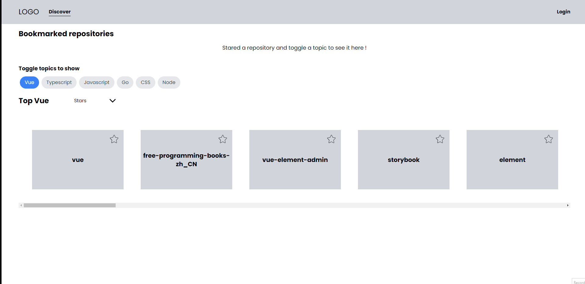

<div align="center" id="top"> 
  

&#xa0;

<a href="https://sword-tech-project.web.app/">Demo</a>

</div>

<h1 align="center">Sword Tech Test</h1>

<p align="center">
  

  

  

  

</p>

<!-- Status -->

<h4 align="center">
	  Sword Tech Test 🚀
    <br/> Complete  ✅
</h4>

<hr>

<p align="center">
  <a href="#dart-about">About</a> &#xa0; | &#xa0; 
  <a href="#sparkles-features">Features</a> &#xa0; | &#xa0;
  <a href="#rocket-technologies">Technologies</a> &#xa0; | &#xa0;
  <a href="#white_check_mark-requirements">Requirements</a> &#xa0; | &#xa0;
  <a href="#checkered_flag-starting">Starting</a> &#xa0; | &#xa0;
  <a href="#memo-license">License</a> &#xa0; | &#xa0;
  <a href="https://github.com/harlleybastos" target="_blank">Author</a>
</p>

<br>

## :dart: About

The challenge is to build a Github repository discovery website with layouts inspired by Netflix,
where users login to their accounts and see the popular repositories from Github by different
topics.

## :sparkles: Features

:heavy_check_mark: Authentication;\
:heavy_check_mark: Local Storage;\
:heavy_check_mark: Github API;\
:heavy_check_mark: Responsive Layout;

## :rocket: Technologies

The following tools were used in this project:

- [Vue.js](https://vuejs.org/)
- [TailwindCSS](https://tailwindcss.com/)
- [TypeScript](https://www.typescriptlang.org/)
- [Javascript](https://developer.mozilla.org/en-US/docs/Web/JavaScript)
- [Cypress](https://www.cypress.io/)
- [Firebase](https://firebase.google.com/?hl=pt)

## :white_check_mark: Requirements

Before starting :checkered_flag:, you need to have [Git](https://git-scm.com) and [Node](https://nodejs.org/en/) installed.

## :checkered_flag: Starting

```bash
# Clone this project
$ git clone https://github.com/harlleybastos/sword-tech-test

# Access
$ cd sword-tech-test

# Install dependencies
$ yarn

# Run the project
$ yarn dev

# The server will initialize in the <http://localhost:5173>
```

## :memo: License

This project is under license from MIT. For more details, see the [LICENSE](LICENSE.md) file.

Made with :heart: by <a href="https://github.com/harlleybastos" target="_blank">Harlley Bastos</a>

&#xa0;

<a href="#top">Back to top</a>
